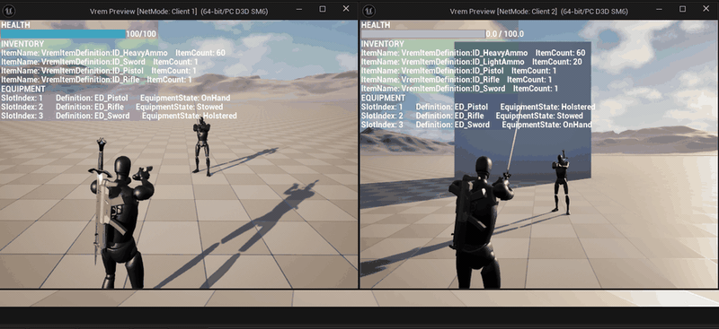
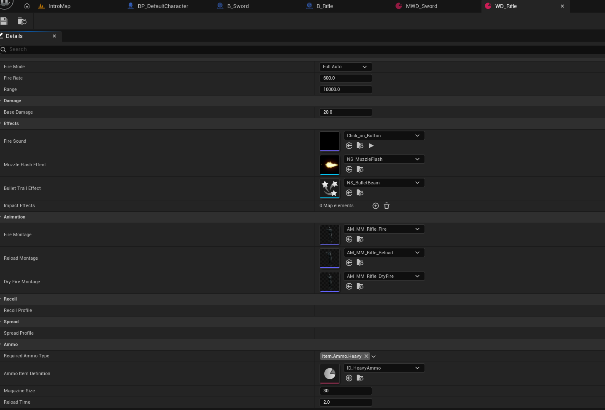
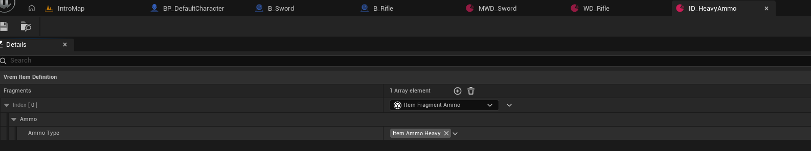
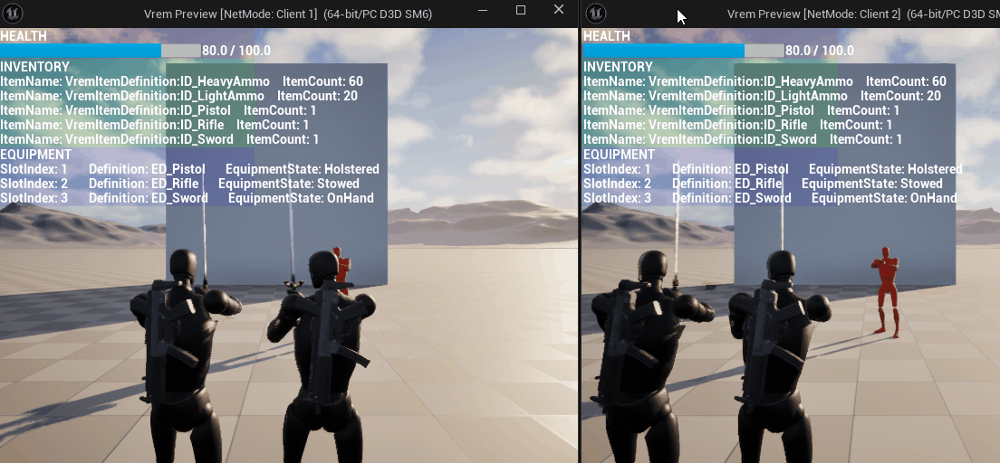

# Vrem-Docs

Vrem 프로젝트의 공개용 문서 레포입니다. 사양 문서와 원본 프로젝트에서 캡처된 gif, png 파일들로 구성되어 있습니다

## Vrem

Unreal Engine 5.7 기반 3인칭 슈팅 액션 프로토타입.

멀티플레이를 전제로 인벤토리 · 장비 · 무기 · 전투 시스템을 C++ 프레임워크로 설계하고,

게임플레이 조립과 정책은 블루프린트에 맡기는 하이브리드 구조로 만들었습니다.

## 설계에서 중요하게 본 것

**개발 과정에서 게임 디자이너와의 협력을 전제로 개발하였습니다**

네이티브 C++에서 핵심 프레임워크를 작성하고, 블루프린트로 세부적인 스펙을 정의합니다

디자이너가 수정사항을 요청하고 DLL 빌드를 기다리는 대신, 자유롭게 테스트할 수 있도록 프레임워크를 구축합니다

캐릭터와 아이템을 **컴포넌트와 데이터 에셋의 조합으로 조립**하는 구조

**모든 시스템은 멀티플레이 환경에서 서버 권위로 동작합니다**

**AI 역시 플레이어와 같은 컴포넌트를 공유하고, 같은 경로를 사용합니다**

동일 함수를 사용하기 때문에 AI도 인벤토리에서 탄을 꺼내 쓰고, 재장전하고, 스프레드의 영향을 받고, 서버 권위 검증을 똑같이 통과합니다. AI를 위해 따로 구현한 사격이 없으니 한쪽만 고쳐져 어긋날 일도 없습니다

위 화면은 두 클라이언트를 나란히 띄운 것입니다. 디버그 HUD에 인벤토리와 장비 슬롯 상태가 그대로 나오고, 주황색 AI가 검은색 플레이어와 같은 무기 시스템으로 싸우며 체력이 양쪽에 동기화됩니다.

## 시스템별 상세 문서

| 문서 | 다루는 것 |
|---|---|
| **[레이어 분리와 복제 규약](docs/architecture/layering.md)** | C++와 블루프린트의 경계를 어디에 왜 그었나. 이미 작성한 C++를 되돌린 판단. 무엇을 누구에게 복제할지의 규칙 |
| [아이템 파이프라인](docs/architecture/items.md) | `Definition` + `Fragment` 합성으로 아이템을 정의하고, 인벤토리 → 장비 → 무기로 흘려보내는 구조 |
| [전투와 애니메이션](docs/architecture/combat.md) | 사격 1발이 클라이언트와 서버를 오가는 과정. 근접 콤보 상태머신. 무기별 애니메이션 교체 |
| [자동화 테스트](docs/architecture/testing.md) | 자동화 테스팅 구축을 통한 회귀 버그 관리 |
