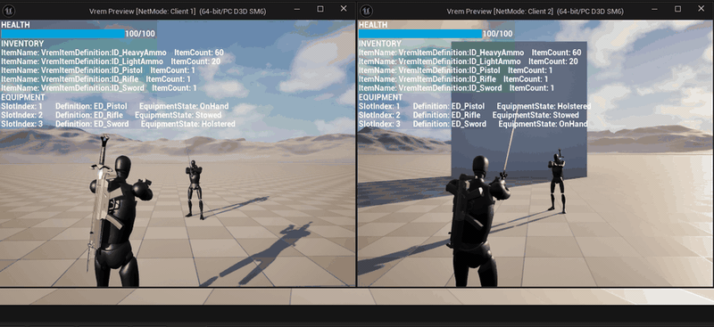
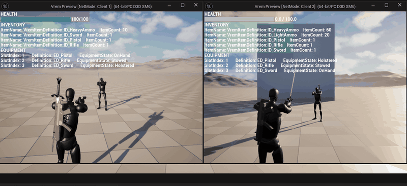
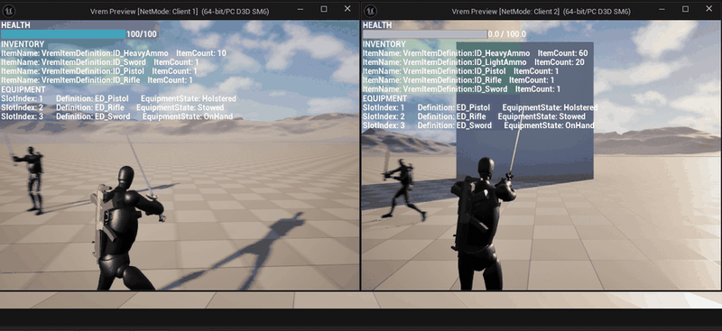
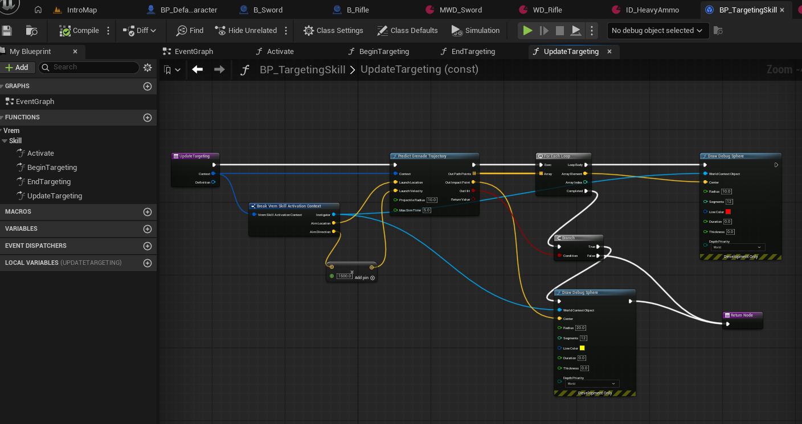

# 전투와 애니메이션

원거리 · 근접 · 회피 · 스킬을 각각 어떻게 만들었고 왜 그렇게 했는지 정리합니다.
복제의 공통 규약은 [레이어 분리 문서](layering.md#프레임워크-레이어가-쥔-것-상태와-복제)에 있습니다.

## 원거리 사격

클라이언트가 먼저 쏘고 서버가 다시 판단합니다. 입력에 즉시 반응해야 하기 때문입니다.
클라이언트는 잔탄을 예측해서 깎고 몽타주를 재생하며, 서버가 복제한 값으로 보정받습니다.

`ServerFire`는 클라이언트가 직접 호출할 수 있는 RPC라 권위 측에서 조건을 다시 봅니다.
재장전도 같습니다. `ExecuteReload()`가 `check(HasAuthority())`로 권위를 단정하고 `CanReload()`를 다시 확인합니다.

**트레이스를 두 번 합니다.**
3인칭이라 카메라는 어깨 뒤에 있고 총구는 캐릭터 앞에 있습니다.
카메라에서 그대로 쏘면 총구가 벽에 막혀 있어도 벽 너머가 맞습니다.
그래서 카메라에서 쏴 조준 지점을 구하고, 총구에서 그 지점을 향해 다시 쏴 명중을 판정합니다.

**총구 위치는 양쪽에서 갈립니다.**

```cpp
// client only, 애니메이션이 반영된 총기 머즐 소켓 위치
FVector GetMuzzleLocation() const;

// server only, 애니메이션이 반영되지 않은 논리적 사격 판정 시작점
FVector GetLogicalMuzzleLocation() const;
```

서버와 클라이언트의 애니메이션 포즈는 어차피 일치하지 않습니다.
판정을 포즈에 의존시키면 재현할 수 없는 결과가 나오므로,
연출은 보이는 대로 클라이언트가, 판정은 계산할 수 있는 대로 서버가 씁니다.

이 선택은 기획이 협동형 PVE라는 전제에서 나왔습니다.
상대가 AI라면 눈에 보이는 총구와 판정 시작점이 조금 어긋나도 플레이 경험을 해치지 않습니다.
플레이어끼리 겨루는 실시간 PVP였다면 그 어긋남이 그대로 공정성 문제가 되므로 다르게 판단했을 것입니다.

**수치는 전부 데이터에 있습니다.**
스프레드와 반동은 `WeaponDefinition`의 `FSpreadProfile` · `FRecoilProfile`에 있어
코드를 고치지 않고 무기마다 다르게 맞춥니다.
무기는 소유자의 상태를 직접 보지 않고 `IGameplayTagAssetInterface`로 묻습니다.
조준 중이면 스프레드 0, 이동이나 공중이면 배율이 붙습니다.
덕분에 소유자가 캐릭터인지 AI인지 몰라도 됩니다.

반동은 반대로 흐릅니다. 무기가 `IVremWeaponHandler::OnWeaponFired()`로 알리고, 카메라를 흔드는 일은 소유자가 합니다.



## 근접 공격

콤보 인덱스를 들고 순서대로 공격합니다.
각 공격은 `AttackDuration` 동안 이어지고, `CancelTime`이 지나면 다음 입력을 받습니다.

- `CancelTime` 이전 — 입력을 무시합니다
- `CancelTime` ~ `AttackDuration` — 다음 콤보로 이어집니다
- 그 뒤로 입력이 없으면 — 콤보가 처음으로 돌아갑니다

**히트 판정은 몽타주가 아니라 `HitTime` 타이머로 서버에서 돌립니다.**
클라이언트의 애니메이션 진행도를 믿으면 포즈가 다른 쪽에서 다른 결과가 나오기 때문입니다.
서버는 판정을 마친 뒤 콤보 인덱스만 멀티캐스트하고, 각 클라이언트가 그 번호로 몽타주를 재생합니다.



## 회피

`DodgeProfile`이 방향(앞 · 뒤 · 좌 · 우)마다 몽타주와 이동 힘, 지속시간, 쿨다운을 들고 있습니다.

**몽타주와 이동을 분리했습니다.**
몽타주는 루트모션을 끄고, 미는 일은 `FRootMotionSource_ConstantForce`가 맡습니다.
애니메이션에 이동이 박혀 있으면 모션을 갈아 끼울 때마다 회피 거리가 달라지기 때문입니다.
힘이 끝나는 순간 속도를 0으로 잘라(`ClampVelocity`) 관성으로 미끄러지지도 않습니다.

회피 한 번은 세 구간입니다.

| 구간 | 길이 | 그동안 |
|---|---|---|
| 힘 | `ForceDuration` | 실제로 밀려납니다 |
| 커밋 | `DodgeDuration` | 다른 입력을 받지 않습니다 |
| 쿨다운 | `DodgeCooldown` | 움직이되 다시 회피하지는 못합니다 |

커밋 구간은 회피 도중에 사격이나 근접으로 빠져나가지 못하게 막습니다.



## 스킬

목적은 스킬을 많이 만드는 것이 아니라 **C++를 건드리지 않고 블루프린트로 추가할 자리**를 여는 것이었습니다.
`UVremSkillBehavior`를 상속한 블루프린트와 그것을 가리키는 데이터 에셋, 둘이면 스킬 하나가 생깁니다.

**GAS를 쓰지 않고 직접 만들었습니다.**
가져다 쓰면 스킬 하나를 붙이는 데 `GameplayEffect` · `GameplayCue` · `AttributeSet`까지 같이 익혀야 합니다.
더 걸렸던 것은 발동이 어디서 걸러지고 쿨다운이 어디서 도는지가 프레임워크 안으로 들어가,
문제가 생겼을 때 들여다볼 자리를 잃는다는 쪽이었습니다.
그래서 GAS가 하는 일만 작게 모방했습니다. 슬롯에 부여하고, 쿨다운을 재고, 타게팅을 거쳐 서버에서 발동하는 모양은 같으니
나중에 필요해지면 이 자리를 GAS로 바꿀 수 있습니다.

**인스턴스를 만들지 않고 CDO를 그대로 부릅니다.**
스킬은 슬롯에 등록되고 여러 번 발동되며 복제도 타는데, 인스턴스를 들면 관리할 대상이 하나 더 늘어납니다.
대신 제약이 붙습니다. CDO는 모든 호출이 공유하므로 거기에 상태를 담으면 서로 침범합니다.
그래서 진입점을 전부 `const`로 두고 필요한 값은 인자로 넘깁니다.

**타게팅은 클라이언트, 발동은 서버입니다.**
조준선 표시는 연출이라 서버가 그릴 이유가 없고 남에게 보여서도 안 됩니다.
세계를 바꾸는 `Activate`만 서버에서 돌고, 발사체를 스폰하는 함수도 첫머리에서 권위를 확인합니다.



## 무기가 바뀌면 애니메이션이 바뀐다

같은 캐릭터가 소총을 들 때와 검을 들 때 다르게 움직여야 합니다.
애님 레이어 링크로 처리하는데, 링크하는 코드는 C++에 없습니다.
C++는 장비 상태가 바뀔 때 `AnimLayerClass`를 델리게이트로 통지만 하고,
`LinkAnimClassLayers`를 부르는 쪽은 캐릭터 블루프린트입니다.

어떤 무기에 어떤 레이어를 물릴지는 애니메이션 작업의 영역이라, 프로그래머가 쥐고 있으면 애니메이터가 손댈 수 없습니다.
원래 C++에 있던 함수를 지워서 옮긴 과정과 그 그래프는 [레이어 분리 문서](layering.md#캐릭터에서-조립과-상호작용을-뺐다-5c81b17)에 있습니다.

그래프에는 `Is Dedicated Server` 분기가 들어 있습니다. 애님 레이어는 연출이므로 데디케이티드 서버에서는 링크하지 않습니다.
C++ 쪽도 같습니다. 멀티캐스트 핸들러 네 곳이 `NM_DedicatedServer`면 바로 반환해 이펙트와 몽타주를 건너뜁니다.

## 플레이어와 AI가 같은 경로로 싸운다

AI는 전투용 코드를 따로 갖고 있지 않습니다. 플레이어와 같은 컴포넌트, 같은 아이템, 같은 사격 경로를 씁니다.

`BTTask_FireBurst`는 `UVremWeaponComponent`라는 이름조차 모릅니다.
폰을 `IVremCombatant`로 캐스팅해 `StartPrimaryFire()`를 부를 뿐이고, 그 구현은 플레이어 입력이 들어가는 함수와 같습니다.

```cpp
void AVremCharacter::StartPrimaryFire()
{
    OnAttackPressed();
}
```

덕분에 AI도 인벤토리에서 탄을 꺼내 쓰고, 재장전하고, 스프레드의 영향을 받습니다.
AI를 위해 따로 구현한 사격이 없으니 한쪽만 고쳐져 어긋날 일도 없습니다.


두 클라이언트를 나란히 띄운 화면이고 주황색이 AI입니다.

## 이 시스템의 경계

| | 프레임워크 (C++) | 게임플레이 (Blueprint) |
|---|---|---|
| 사격 | 권위 검증 · 히트스캔 · 복제 | 언제 쏠 수 있는지, 무기 수치 |
| 근접 | 콤보 상태 · 히트 타이머 · 판정 | 콤보 시퀀스 구성, 몽타주와 타이밍 값 |
| 회피 | 힘 적용 · 구간 관리 | 방향별 몽타주와 수치 |
| 스킬 | 호출 시점과 권위 보장 | `SkillBehavior` 로 실제 동작 구현 |
| 애니메이션 | `AnimLayerClass` 통지 | 실제 레이어 링크, 서버 분기 |
| AI | `IVremCombatant` 계약 | 비헤이비어 트리 구성, 인지 설정 |

## 남은 과제

- `ServerMeleeAttack`과 `ServerDodge`는 클라이언트 요청을 그대로 실행합니다. 사격·재장전 경로처럼 권위 측 재검증이 필요합니다
- 근접의 `ComboIndex`를 서버가 검증하지 않습니다. 서버가 콤보 상태를 들고 있지 않아 상태 추적을 먼저 만들어야 합니다
- `ServerActivateSkill`이 쿨다운을 검증하지 않습니다. 쿨다운을 복제하지 않고 각자 로컬 타이머로 둔 결과입니다
- 회피의 무적 프레임은 `DodgeProfile`에 값만 있고 실제 무적 처리가 없습니다
- 수류탄은 타게팅과 발사체 스폰까지만 구현했습니다. 날아가서 폭발하는 부분은 만들지 않았습니다
- `WD_Rifle`의 `Impact Effects`가 비어 있어 피격 이펙트가 재생되지 않습니다
