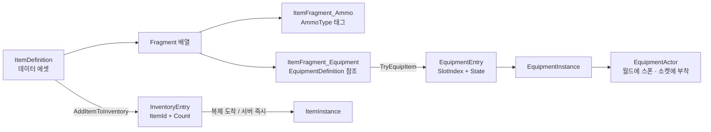
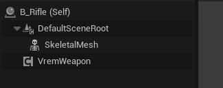

# 아이템 파이프라인

아이템 하나가 데이터 에셋에서 출발해 인벤토리를 거쳐 손에 들린 무기가 되기까지를 다룹니다.

이 파이프라인은 [레이어 분리](layering.md)에서 말한 **프레임워크 레이어**에 속합니다.
무엇을 들고 무엇을 장착할지는 블루프린트가 정하고, 여기 있는 코드는
그 요청을 받아 상태를 만들고 복제합니다.

## 상속 대신 합성

아이템 종류마다 클래스를 파면 금방 막힙니다.
"장착 가능한 탄약"이나 "소모품이면서 던질 수 있는 것"이 나오는 순간
상속 트리로는 표현할 수 없습니다.

그래서 `UVremItemDefinition`은 자기가 무엇인지 말하지 않습니다.
대신 **조각(`UItemFragment`)을 배열로 들고 있고**, 무엇을 할 수 있는지는 조각이 정합니다.

```cpp
UCLASS()
class VREM_API UVremItemDefinition : public UPrimaryDataAsset
{
    UPROPERTY(EditDefaultsOnly, Instanced)
    TArray<UItemFragment*> Fragments;

    template<typename T> T* FindFragment() const;   // 조각이 있으면 그 능력이 있다
};
```

`ItemFragment_Ammo`가 붙어 있으면 탄약이고, `ItemFragment_Equipment`가 붙어 있으면 장착할 수 있습니다.
둘 다 붙이면 둘 다입니다. 새 능력이 필요하면 조각 클래스를 하나 더 만들면 되고,
기존 아이템은 건드리지 않습니다.

<!-- media: Fragment 합성이 에디터에서 보이는 모습 -->


위 스크린샷의 `ID_HeavyAmmo`는 조각 하나(`ItemFragment_Ammo`)만 들고 있고,
그 조각이 `Item.Ammo.Heavy` 태그를 쥡니다.
무기는 이 태그로 자기가 쓸 탄약을 찾습니다. 아이템 클래스를 아는 게 아니라 태그로 만납니다.

## 정의와 인스턴스를 나눈 이유

`UVremItemDefinition`은 에디터에서 만드는 데이터 에셋입니다.
인벤토리에 소총이 몇 정 있든 이 에셋은 하나고, 모든 소유자가 같은 것을 가리킵니다.
패키징된 뒤에는 런타임에 고쳐 쓸 수도 없습니다.

그래서 **아이템 하나하나를 가리킬 대상**이 따로 필요합니다.
목록에 `Entry`가 생길 때마다 `UVremItemInstance`를 만들어 붙이는 이유입니다.

지금 그 대상이 하는 일은 둘입니다.

- **조각을 찾는 창구** — 인벤토리가 "이 칸에 탄약 조각이 붙어 있나"를 물을 때 `Entry.ItemInstance->FindFragmentByClass()`를 거칩니다. 태그로 탄약 수를 셀 때 타는 경로입니다
- **조각에게 알리는 통로** — 아이템이 생기고 사라질 때 `OnItemCreated` / `OnItemRemoved`를 조각들에게 전달합니다

아이템마다 달라지는 값을 둔다면 이 자리가 되겠지만 지금은 비어 있습니다.
인벤토리는 같은 아이템을 `ItemId`와 개수로 묶어 세고, 잔탄은 무기 액터에 붙은 컴포넌트가 따로 들고 있습니다.

복제할 때 `Definition`은 보내지 않고 `Instance`는 각자 만드는 이유는
[레이어 분리 문서](layering.md#definition은-보내지-않고-instance는-각자-만든다)에 적었습니다.

## 인벤토리에서 장비로



인벤토리는 아이템을 `FPrimaryAssetId`로 들고 개수를 셉니다.
포인터가 아니라 ID로 들기 때문에 복제할 때 에셋 참조를 통째로 보낼 필요가 없습니다.

장비로 넘어가는 판단은 코드에 없습니다.
"인벤토리에 아이템이 들어오면 장비 슬롯에 올린다"는 **게임 규칙이라 블루프린트에 있습니다.**
`OnItemInstanceCreated` 델리게이트를 받아 `ItemFragment_Equipment`를 찾고,
있으면 `RequestSetCurrentWeapon`을 호출하는 그래프가 그 일을 합니다.
[레이어 분리 문서](layering.md#경계를-지키려고-되돌린-것)에서 이 판단이 어떻게 여기까지 내려왔는지 다뤘습니다.

<!-- media: 장비 액터도 블루프린트로 조립한다 -->


무기 액터는 `SkeletalMesh`와 `VremWeapon` 컴포넌트로 조립됩니다.
그래서 무기 컴포넌트가 소유자를 찾을 때 `GetOwner()->GetOwner()`를 거칩니다 —
컴포넌트의 주인은 무기 액터이고, 무기 액터의 주인이 캐릭터입니다.

## 탄약은 사라지지도 늘어나지도 않는다

무기를 장착하면 인벤토리에서 탄약을 꺼내 매거진을 채우고,
무기를 버리면 매거진에 남은 탄을 인벤토리로 돌려줍니다.

- 장착 시 `BeginPlay`에서 `Inventory->RemoveAmmo(RequiredAmmoType, MagazineSize)`
- 해제 시 `EndPlay`에서 남은 탄을 `AddItemToInventory`로 반환

둘 다 서버에서만 실행합니다. 다만 보존되는 것은 개수까지입니다.
잔탄은 무기 액터가 살아 있는 동안만 유지되므로, 슬롯을 바꿔 들어도 액터가 파괴되지 않아 그대로 남습니다.
무기를 해제하면 남은 탄이 인벤토리 풀로 합쳐져 "반쯤 쓴 탄창"이라는 상태는 사라집니다.

무기는 탄약 아이템의 클래스를 모릅니다. `RequiredAmmoType` 태그로 인벤토리에 묻습니다.

```cpp
UPROPERTY(EditDefaultsOnly, Category = "Ammo")
FGameplayTag RequiredAmmoType;
```

<!-- media: 무기 데이터 에셋 -->


다만 지금은 태그 옆에 `AmmoItemDefinition` 필드가 하나 더 있습니다.
탄을 **돌려줄 때**는 태그만으로 어떤 아이템을 만들지 알 수 없어서,
임시로 아이템 정의를 직접 들고 있는 것입니다.
태그에서 아이템 정의를 찾는 매핑 테이블로 대체해야 할 자리이고 코드에 `TODO`로 표시해 두었습니다.

## 이 시스템의 경계

| | 프레임워크 (C++) | 게임플레이 (Blueprint) |
|---|---|---|
| 아이템이 무엇인가 | `Fragment` 클래스가 능력을 정의 | 데이터 에셋이 어떤 조각을 붙일지 결정 |
| 인벤토리 | 목록 보유 · 복제 · 개수 계산 | 무엇을 주울지, 시작 아이템이 무엇인지 |
| 장비 | 슬롯 상태와 소켓 부착, 일관성 유지 | 어떤 아이템을 어느 슬롯에 올릴지 |
| 탄약 | 태그로 소모 · 반환 | 어떤 탄을 얼마나 줄지 |
