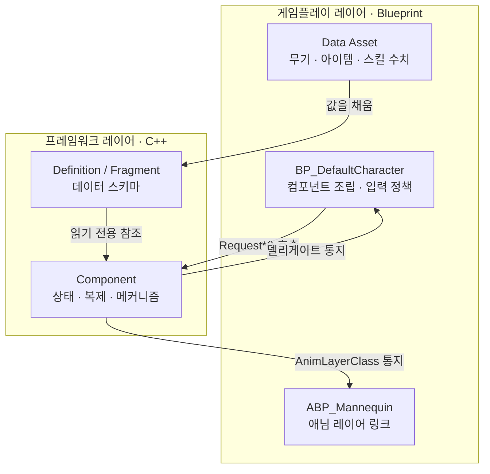
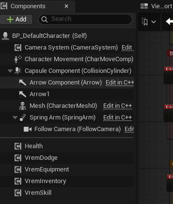
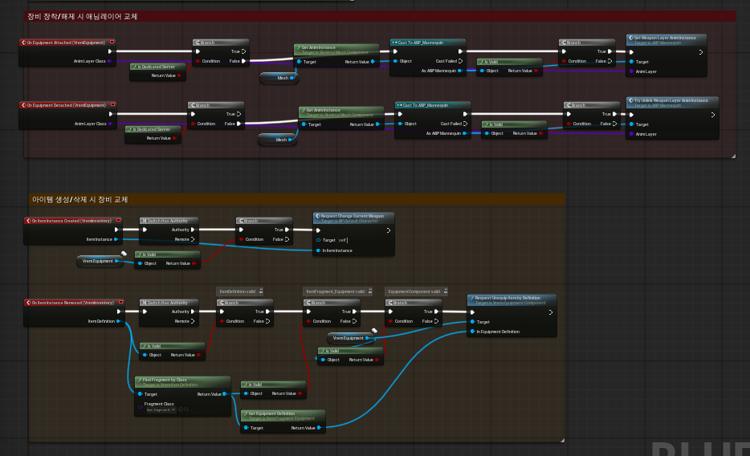

# 레이어 분리와 복제 규약

Vrem은 C++와 블루프린트를 **프레임워크 레이어**와 **게임플레이 레이어**로 나누고 있습니다.
이 문서는 그 경계를 어디에 그었는지, 왜 그었는지, 그리고 경계를 지키려고 이미 작성한 C++를 어떻게 되돌렸는지를 다룹니다.

## 왜 나눴나

네이티브 C++로 작성된 로직은 버전 관리는 간편하지만, 약간의 수정만으로도 재빌드가 필요해 빠르게 다양한 게임 디자인을 시도하기 어렵습니다.
특히 게임 디자이너와 협업할 경우, 디자이너가 개발자에게 의도를 전달하는 과정에서 초기 의도가 변질되고, 빌드를 기다리고 피드백을 준비하는 등 개발속도에 병목을 일으킨다고 생각했습니다.

또한 네이티브 C++의 경우 에셋의 레퍼런스 추적이 어려워진다는 단점도 있습니다. 따라서 에셋을 직접 참조하는 데이터는 C++ 바깥에 둘 필요가 있었습니다.

## 경계 규칙

> **상태를 들고 복제되는 것은 C++가, 무엇을 조립하고 언제 허용할지는 블루프린트가 정한다.**

||프레임워크 레이어 (C++)|게임플레이 레이어 (Blueprint)|
|-|-|-|
|맡는 것|상태 보유, 복제, 서버 권위 검증, 데이터 스키마|컴포넌트 조립, 정책 결정, 연출 연결, 수치|
|예|`UVremEquipmentComponent`가 슬롯 상태를 들고 복제합니다|`BP_DefaultCharacter`가 어떤 컴포넌트를 붙일지 정합니다|
|예|`UVremWeaponDefinition`이 무기 필드를 정의합니다|데이터 에셋이 그 필드에 값을 채웁니다|
|예|장비 교체 시 `AnimLayerClass`를 통지합니다|`ABP_Mannequin`이 실제로 레이어를 링크합니다|



<!-- media: BP가 컴포넌트를 조립하는 모습 -->



구분선 위쪽 `Edit in C++` 가 붙은 것들이 C++ 에서 만든 컴포넌트이고,
아래쪽 Health · VremDodge · VremEquipment · VremInventory · VremSkill 다섯은
블루프린트가 붙인 것입니다. 교체하거나 조합할 대상만 위로 올라와 있습니다.

### 경계는 교리가 아니라 기본값이다

규칙을 세웠지만 양방향 이동을 막아두지는 않았습니다.

경계를 완벽하게 지키려고 추상화를 미리 쌓으면,
아직 어디가 정책이고 어디가 메커니즘인지 모르는 단계에서 오버엔지니어링이 될 여지가 있습니다. 개발 속도를 위해 유동적으로 옮길 여지를 남기는 쪽을 택했습니다.

## 경계가 코드에 남긴 표식

컴포넌트 헤더에는 게임플레이 레이어가 호출하는 함수들을 `// Blueprint API`로 묶어 둡니다.
다섯 개 컴포넌트에 같은 표식이 있습니다.

* [`VremCameraSystem.h:20`](../../Source/Vrem/Camera/VremCameraSystem.h#L20)
* [`VremMeleeComponent.h:21`](../../Source/Vrem/Equipment/MeleeWeapon/VremMeleeComponent.h#L21)
* [`VremEquipmentComponent.h:178`](../../Source/Vrem/Equipment/VremEquipmentComponent.h#L178)
* [`VremWeaponComponent.h:52`](../../Source/Vrem/Equipment/Weapon/VremWeaponComponent.h#L52)
* [`VremSkillComponent.h:108`](../../Source/Vrem/Skill/VremSkillComponent.h#L108)

이 구역의 함수는 대부분 `Request` 접두사를 씁니다.
`RequestFire()` · `RequestReload()` · `RequestSetCurrentWeapon()` 처럼,
**요청일 뿐 실행이 보장되지 않는다**는 뜻을 이름에 담았습니다.
실제 실행 여부는 프레임워크 레이어가 권위와 상태를 보고 판단합니다.

## 경계를 지키려고 되돌린 것

경계는 처음부터 있었던 게 아니라, 이미 작성한 C++를 걷어내며 만들었습니다.

### 장비 컴포넌트에서 게임 규칙을 뺐다 (`0f77802`)

이전의 `EquipmentComponent`는 스스로 게임 로직을 가지고 있었습니다.
예를 들어, "새로 장착하는 장비의 `SlotType`이 손에 든 것과 다르면 홀스터로 보낸다"는 식입니다.

```cpp
// 변경 전 - 컴포넌트가 게임 규칙을 들고 있었다
if (OnHandEntry->EquipmentDefiniton->SlotType != NewEntry.EquipmentDefiniton->SlotType)
{
    NewEntry.SetAndApplyEquipmentState(EEquipmentState::Holstered);
}
```

이건 게임 디자인이지 장비 관리 메커니즘이 아닙니다.
근접과 원거리를 하나씩 들게 할지, 같은 종류를 둘 들게 할지는 기획이 바뀌면 같이 바뀝니다.

그래서 판단을 인자로 끌어올렸습니다.

```cpp
// 변경 후 - 어디로 밀어낼지는 호출자가 정해서 넘긴다
void SetCurrentWeapon(int32 InWeaponSlotIndex, EEquipmentState PrevOnHandDest, bool bSkipEquipMontage);
```

반면, "손에 있던 장비가 홀스터로 밀리면 원래 홀스터에 있던 것은 Stowed로 내려간다" 같은
**상태 일관성 규칙**은 기획과 무관하게 항상 참이므로 프레임워크의 몫입니다.

### 캐릭터에서 조립과 상호작용을 뺐다 (`5c81b17`)

정책이 컴포넌트에서 캐릭터로 올라오자 이번에는 캐릭터가 두꺼워졌습니다.
캐릭터가 컴포넌트를 만들고, 서로 연결하고, 아이템이 들어오면 어느 슬롯에 넣을지까지 정하고 있었습니다.

그 덩어리를 블루프린트로 옮기면서 `VremCharacter.cpp` 가 633줄에서 405줄로 줄었고,
커밋 전체로는 425줄을 넣고 448줄을 지워 코드가 오히려 줄었습니다.

같은 커밋에서 `UVremAnimInstance::SetWeaponAnimLayer()` 도 지웠습니다.
`LinkAnimClassLayers` 를 C++ 에서 호출하던 함수인데,
어떤 무기에 어떤 레이어를 물릴지는 애니메이션 작업의 영역이라 프로그래머가 쥐고 있으면 애니메이터가 손댈 수 없습니다.



위쪽 빨간 주석이 그 `SetWeaponAnimLayer()` 가 옮겨간 자리입니다. C++ 는 `On Equipment Attached` 로 `AnimLayerClass` 를 통지만 하고, `ABP_Mannequin` 에 링크하는 일은 블루프린트가 합니다.

아래쪽 주황 주석이 `0f77802` 에서 컴포넌트가 내려놓은 장비 정책이 최종적으로 도착한 자리입니다. 아이템이 인벤토리에 들어오면 어느 슬롯에 올릴지를 `Switch Has Authority` 를 거쳐 서버에서만 판단합니다.

## 프레임워크 레이어가 쥔 것: 상태와 복제

경계의 정의상 복제는 전부 C++에 있습니다.

### Definition은 보내지 않고, Instance는 각자 만든다

`Definition`은 에디터에서 만든 데이터 에셋이라 서버와 클라이언트가 이미 같은 것을 갖고 있습니다. 보낼 이유가 없어서, 인벤토리는 아이템 포인터 대신 `FPrimaryAssetId`만 실어 보냅니다.

`Instance`는 런타임에 생기는 객체라 아예 복제 대상에서 뺐습니다.

```cpp
UPROPERTY(NotReplicated, Transient)
UVremItemInstance* ItemInstance = nullptr;
```

선을 넘는 것은 `Entry`가 들고 있는 값뿐이고, 각 클라이언트가 그 값을 받아 자기 쪽 `Instance`를 직접 만듭니다. 같은 입력으로 양쪽에서 같은 결과를 만드는 셈입니다.

### 목록은 FastArray로 복제한다

인벤토리 · 장비 · 스킬은 길이가 변하는 목록이고, 셋 다 `FFastArraySerializer`를 씁니다.

배열 전체를 복제하면 한 칸이 바뀔 때마다 전부 다시 가기 때문에, 바뀐 항목만 보내고 수신 측에서 `PostReplicatedAdd` / `PostReplicatedChange` / `PreReplicatedRemove` 콜백을 줍니다.

이 콜백이 중요한 이유는 대역폭보다도 **타이밍**입니다.
복제로 도착한 `Entry`에 대해 클라이언트에서 `Instance`를 만들어 붙여야 하는데,
`OnRep` 하나로는 "무엇이 새로 왔는지"를 알 수 없었습니다.

### 서버 재검증은 아직 무기 경로에만 있다

`Server` RPC 는 클라이언트가 직접 호출할 수 있으므로 권위 측에서 다시 판단해야 합니다.
현재 그렇게 하고 있는 것은 둘뿐입니다.

|RPC|재검증|
|-|-|
|`ServerFire`|잔탄 · 재장전 · 발사 간격을 다시 봅니다|
|`ServerStartReload`|`CanReload()` 를 다시 봅니다|
|`ServerMeleeAttack`|없음. 클라이언트가 보낸 `ComboIndex` 를 그대로 씁니다|
|`ServerDodge`|없음. `CanDodge()` 를 호출하지 않습니다|
|`ServerActivateSkill`|슬롯·정의 유효성만 봅니다. 쿨다운은 검사하지 않습니다|

구체적으로 어떻게 검증하는지는 [전투 문서](combat.md#원거리-사격)에 적었습니다.

## 이 문서에서 쓰는 말

|용어|뜻|
|-|-|
|**프레임워크 레이어**|C++ 코드. 상태를 들고, 복제하고, 서버 권위로 검증하고, 데이터 스키마를 정의합니다|
|**게임플레이 레이어**|블루프린트와 데이터 에셋. 무엇을 조립할지, 언제 허용할지, 수치가 얼마인지를 정합니다|
|**Definition**|에디터에서 만드는 데이터 에셋. 아이템 · 무기 · 스킬 · 장비가 각각 갖습니다. 런타임에 바뀌지 않습니다|
|**Instance**|`Definition`으로부터 런타임에 만들어지는 객체. 잔탄이나 강화 수치 같은 **변하는 상태**를 여기에 둡니다|
|**Fragment**|`Definition`에 꽂는 선택적 조각. 상속 대신 합성으로 "이 아이템이 무엇일 수 있는가"를 표현합니다|
|**Entry**|복제되는 목록의 한 칸. `FFastArraySerializerItem`을 상속합니다|

`Definition` / `Instance` / `Fragment`가 실제로 어떻게 맞물리는지는
[아이템 파이프라인 문서](items.md)에서 다룹니다.

