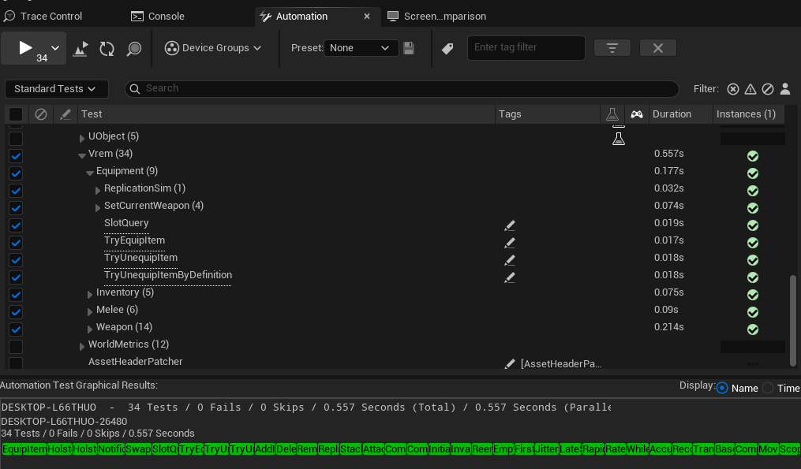

# 자동화 테스트

AI로 코드를 생성하는 작업 방식에서도 테스트는 사람이 쥐고 있어야 하는 영역이라고 봤습니다.
구현을 누가 썼든 회귀는 테스트가 막고, 무엇을 의도했는지는 테스트에 남습니다.
그래서 무엇을 어떻게 동작시키려 했는지를 테스트 이름과 검증 메시지에 적어 두었습니다.

지금 UE 자동화 테스트 34개가 있습니다.

<!-- media: 테스트 실행 결과 -->


## 테스트 월드를 직접 만든다

컴포넌트 테스트에는 레벨이 필요 없지만 `UWorld`는 필요합니다.
액터를 스폰하고 타이머를 쓰기 때문입니다.

```cpp
UWorld* CreateTestWorld()
{
    UWorld* World = UWorld::CreateWorld(EWorldType::Game, false);
    FWorldContext& WorldContext = GEngine->CreateNewWorldContext(EWorldType::Game);
    WorldContext.SetCurrentWorld(World);
    World->InitializeActorsForPlay(FURL());
    World->BeginPlay();
    return World;
}
```

테스트마다 새 월드를 만들고 끝나면 파괴하므로 서로 상태를 남기지 않습니다.

프로덕션 코드에는 테스트용 진입점을 `#if WITH_AUTOMATION_WORKER`로 감싸 두었습니다.
`SetWeaponDefinition_ForTest` 처럼 의존성을 주입하거나,
`GetEquipmentStateAtSlot` 처럼 내부 상태를 확인하는 함수들입니다.
빌드 설정에서 자동화가 꺼지면 컴파일되지 않습니다.

## 복제를 테스트 안에서 재현한다

인벤토리와 장비는 복제 후 클라이언트에서 인스턴스를 만들어 붙입니다.
이 흐름이 깨져도 서버 화면은 멀쩡하기 때문에, 2인 플레이를 띄워야만 보입니다.

그래서 컴포넌트 두 개를 만들어 하나를 서버, 하나를 클라이언트로 두고 복제를 흉내 냅니다.

```cpp
void UVremEquipmentComponent::SimulateReplicateFrom(const UVremEquipmentComponent* Source)
{
    EquipmentList = Source->EquipmentList;
    OnRep_EquipmentList();
}
```

테스트는 서버 쪽에서 장비를 바꾸고, 복제를 시뮬레이션한 뒤, 클라이언트 쪽 상태를 확인합니다.

```cpp
ServerComp->TryEquipItem(Def, 1);
TestEqual(TEXT("Client should have 0 items before replication"), ClientComp->GetEquipmentItemNum(), 0);

ClientComp->SimulateReplicateFrom(ServerComp);
TestEqual(TEXT("Client should have 1 item after replication"), ClientComp->GetEquipmentItemNum(), 1);
```

이 방식의 한계는 분명합니다. 구조체를 직접 복사하므로 `FastArrayDeltaSerialize`를 거치지 않습니다.
따라서 "복제가 도착한 뒤의 처리가 올바른가"는 검증하지만
"직렬화 자체가 올바른가"는 검증하지 못합니다.
직렬화까지 보려면 실제 네트워크 드라이버를 띄워야 하고, 그건 이 테스트의 범위를 넘습니다.

## 기대하는 경고를 선언한다

장비 테스트는 `NewObject`로 만든 빈 `EquipmentDefinition`을 씁니다.
`EquipmentActorClass`와 `EquipMontage`가 없으므로 프로덕션 코드가 경고를 찍습니다. 정상 동작입니다.

이 경고를 그냥 두면 테스트 결과가 노란색으로 뜨고, 진짜 문제와 구분되지 않습니다.
그래서 기대하는 로그로 선언합니다.

```cpp
Test.AddExpectedMessagePlain(
    TEXT("SpawnEquipmentActor: EquipmentDefinition EquipmentActorClass is not set"),
    ELogVerbosity::Warning, EAutomationExpectedMessageFlags::Contains, 0);
```

마지막 인자 `Occurrences = 0`은 "횟수는 상관없지만 최소 한 번은 나와야 한다"는 뜻입니다.
그래서 이건 경고를 숨기는 장치가 아닙니다.
경고가 사라지면 오히려 테스트가 실패합니다 — 프로덕션 코드가 조용히 바뀐 것을 잡아냅니다.
